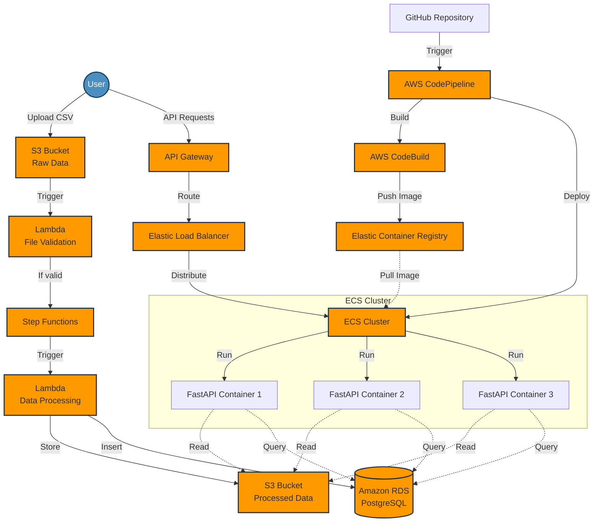

# Globant Data Engineering Challenge

This project implements a scalable, hybrid architecture for processing and analyzing employee hiring data.

## Architecture Overview

My solution combines serverless components for data processing with containerized components for the API. Here's an overview of the architecture:

1. **Data Ingestion**: CSV files are uploaded to an S3 bucket ("globant-raw-data").
2. **Data Validation**: An AWS Lambda function validates the uploaded files.
3. **Data Processing**: Another Lambda function processes the validated data and stores it in a processed data S3 bucket ("globant-processed-data").
4. **API**: A containerized FastAPI application, running on AWS ECS, serves the processed data and provides analytical endpoints.
5. **Database**: Amazon RDS (PostgreSQL) stores structured data for quick querying.
6. **Orchestration**: AWS Step Functions manage the workflow from file upload to data processing.
7. **CI/CD**: AWS CodePipeline automates the build and deployment process.

## Architecture Diagram

```ascii
+----------------+     +-------------------+     +------------------+
|   S3 Bucket    |     |   AWS Lambda      |     |   S3 Bucket      |
| (Raw Data)     +---->+ (File Validation) +---->+ (Processed Data) |
+----------------+     +-------------------+     +------------------+
                                |                         |
                                |                         |
                                v                         v
                       +-------------------+     +------------------+
                       |   AWS Lambda      |     |   Amazon RDS     |
                       | (Data Processing) +---->+   (PostgreSQL)   |
                       +-------------------+     +------------------+
                                                          |
                                                          |
                    +--------------------+                |
                    |   AWS ECS Cluster  |                |
                    | +----------------+ |                |
                    | |  Docker        | |                |
                    | |  Container     | |                |
+-------------+     | | +------------+ | |                |
|   API       |     | | |  FastAPI   | | |                |
|   Gateway   +-----+ | |  App       | | |<---------------+
+-------------+     | | +------------+ | |
                    | +----------------+ |
                    +--------------------+
```

## Key Components

1. **S3 Buckets**: Store raw and processed data.
2. **Lambda Functions**: Perform file validation and data processing.
3. **Step Functions**: Orchestrate the data processing workflow.
4. **ECS**: Runs the containerized FastAPI application.
5. **RDS**: Stores structured data for efficient querying.
6. **API Gateway**: Provides HTTP endpoints for the API.
7. **ECR**: Stores Docker images for the API application.
8. **CodePipeline**: Automates the CI/CD process.

## API Endpoints

- `POST /upload`: Upload CSV files (handled by S3 and Lambda)
- `GET /metrics/hires`: Get number of employees hired for each job and department in 2021 by quarter
- `GET /metrics/departments`: Get departments that hired more than the mean in 2021

## Setup and Deployment

1. Clone this repository
2. Install AWS CLI and configure your credentials
3. Install Terraform
4. Run `terraform init` and `terraform apply` to provision the infrastructure
5. Build and push the Docker image to ECR
6. Update the ECS task definition with the new image URI
7. Deploy the updated ECS service

## Local Development

Use Docker Compose for local development:

```bash
docker-compose up --build
```

This will start the FastAPI application and a PostgreSQL database locally.

## Testing

Run unit tests:

```bash
pytest tests/
```

## CI/CD

The CI/CD pipeline is managed by AWS CodePipeline. It's triggered on pushes to the main branch and performs the following steps:

1. Source: Pull the latest code from CodeCommit
2. Build: Build the Docker image and run tests
3. Deploy: Update the ECS service with the new image


## Architecture Diagram



